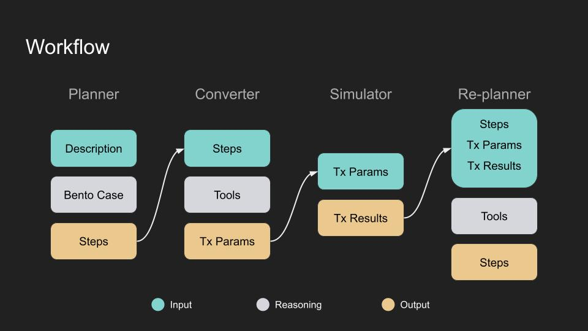

# Multi-agent system for Translating Natural Language into Blockchain Transactions

This system leverages multiple AI agents to seamlessly translate natural language prompts into precise and efficient sequences of blockchain transactions.

As of `September 18, 2024`, it can accurately generate a multi-step batch transaction from a simple description in under 1 minute.

### Demo

#### Input

```
Stake 0.3 ETH with Lido and restake on Eigenpie"
```

#### Output

The following shows the output in pretty format. (The actual output is a JSON object)

```
Original Intent: Stake 0.3 ETH with Lido and restake on Eigenpie
==================================================
#1
Transaction Description:
  Stake 0.3 ETH to Lido.

Transaction Parameters:
  From:    0xd8dA6BF26964aF9D7eEd9e03E53415D37aA96045
  To:      0xae7ab96520de3a18e5e111b5eaab095312d7fe84
  Data:    0x
  Value:   0x429d069189e0000

Transaction Summary:
  +0.299999999999999999 steth
  -0.3 eth
--------------------------------------------------
#2
Transaction Description:
  Approve 0.299999999999999999 stETH to Eigenpie.

Transaction Parameters:
  From:    0xd8dA6BF26964aF9D7eEd9e03E53415D37aA96045
  To:      0xae7ab96520de3a18e5e111b5eaab095312d7fe84
  Data:    0x095ea7b300000000000000000000000024db6717db1c75b9db6ea47164d8730b63875db70000000000000000000000000000000000000000000000000429d069189dffff
  Value:   0x0
--------------------------------------------------
#3
Transaction Description:
  Stake 0.299999999999999999 stETH to Eigenpie.

Transaction Parameters:
  From:    0xd8dA6BF26964aF9D7eEd9e03E53415D37aA96045
  To:      0x24db6717dB1C75B9Db6eA47164D8730B63875dB7
  Data:    0x2ebe07c8000000000000000000000000ae7ab96520de3a18e5e111b5eaab095312d7fe840000000000000000000000000000000000000000000000000429d069189dffff00000000000000000000000000000000000000000000000000000000000000000000000000000000000000000000000000000000000000000000000000000000
  Value:   0x0

Transaction Summary:
  +0.29316210172728706 msteth
  -0.299999999999999999 steth
--------------------------------------------------
```

### Workflow



1. **Planner: Convert User Intent into Concrete Steps**

   - Input: Natural language prompt (e.g., "Stake 0.03 ETH with Lido and deposit to Eigenpie.")
   - Task: Translate the user’s intent into concrete steps.
   - Output: List of steps (e.g., "Stake 0.03 ETH to Lido", "Approve stETH to Eigenpie", "Stake stETH to Eigenpie")

2. **Converter: Convert Steps into Transaction Parameters**

   - Input: Each step from the previous phase (e.g., "Stake 0.03 ETH to Lido")
   - Task: For each step, convert it into appropriate transaction parameters.
   - Output: Transaction parameters for each step.

3. **Simulator: Simulate Transactions**

   - Input: Transaction parameters for each step.
   - Task: Simulate the transaction to ensure feasibility.
   - Output: Simulation results, including whether the step succeeded or failed, and any necessary adjustments.

4. **Replanner: Refine & Update Steps**

   - Input: Results from simulation
   - Task: Refine each step as needed based on the simulation results.
     - If the simulation fails (e.g., invalid parameters), adjust the parameters.
     - If the step passes simulation, mark it as successful.
   - Output: Updated steps, ready to be presented to the user.

5. **Return Results to User**

   - Input: Finalized steps.
   - Task: Return the list of steps and their associated transaction parameters to the user.
   - Output: A object containing the steps and their associated transaction details.

### Set up

Create a `.env` file in the root directory of the project and add the following environment variables:

```bash
# For LangSmith tracing
LANGCHAIN_API_KEY=

# AI providers
OPENAI_API_KEY=
```
